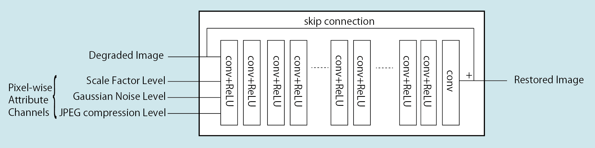
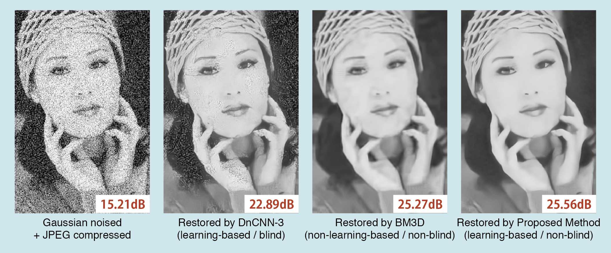
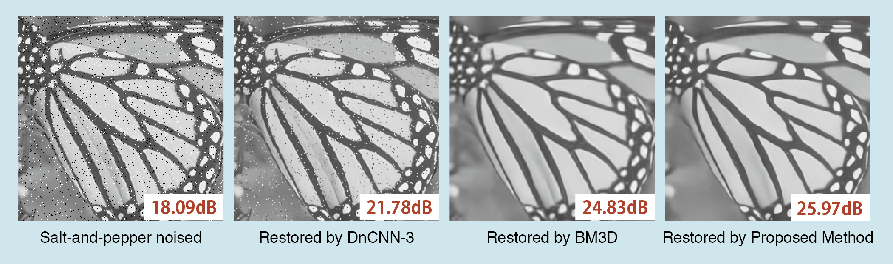
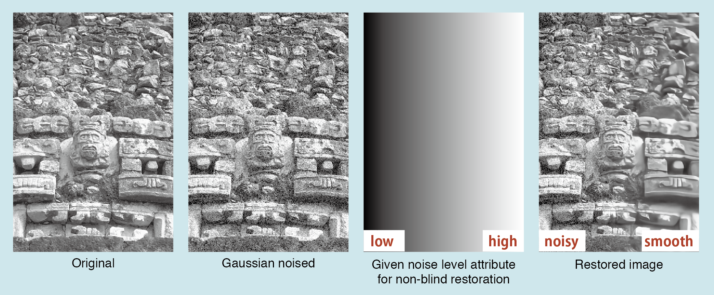

# [Non-blind Image Restoration Based on Convolutional Neural Network](https://arxiv.org/abs/1809.03757)

## Contents

**demos**:  demo scripts: `demo_{*}.m`.

**model**:  a model for non-blind image restoration. It is trained with the equivalent training dataset to [DnCNN-3](https://github.com/cszn/DnCNN), but with the true degradation attributions.

**testsets**: datasets: Set5, Set14, and BSD100 are inculuded.

## Execution

1. Install [MatConvNet](http://www.vlfeat.org/matconvnet/).
1. In MATLAB, `>> run matconvnet/matlab/vl_setupnn.m`.
1. Then, run a demo script by `>> run demos/demo_{*}.m`.

## Comparison

### DnCNN

To compare with [DnCNN-3](https://github.com/cszn/DnCNN) model,
copy their `model/DnCNN3.mat` to our `model/` directory and change to `useDnCNN = 1;` in the demo scripts.

> Please note that DnCNN-3 model itself is expected to achieve higher performance if trained directly with perturbed degradations. This comparison is intended to demonstrate that CNN-based model performs poorly on images with untrained degradation model.


### BM3D

To compare with [BM3D](http://www.cs.tut.fi/~foi/GCF-BM3D/), download their MATLAB software in `bm3d/` directory and change to `useBM3D = 1;` in the demo scripts.

## Proposed Method

- Network structure
   
- Restoration for degradation with perturbation
   
- Restoration for untrained degradation
   
- Restoration level control
   

## Abstract

Blind image restoration processors based on convolutional neural network (CNN) are intensively researched because of their high performance. However, they are too sensitive to the perturbation of the degradation model. They easily fail to restore the image whose degradation model is slightly different from the trained degradation model. In this paper, we propose a non-blind CNN-based image restoration processor, aiming to be robust against a perturbation of the degradation model compared to the blind restoration processor. Experimental comparisons demonstrate that the proposed non-blind CNN-based image restoration processor can robustly restore images compared to existing blind CNN-based image restoration processors.

## Citation

```
@article{uchida2018nonblind,
  title={Non-blind Image Restoration Based on Convolutional Neural Network},
  author={Uchida, Kazutaka and Tanaka, Masayuki and Okutomi, Masatoshi},
  journal={arXiv preprint arXiv:1809.03757},
  year={2018}
}
```
